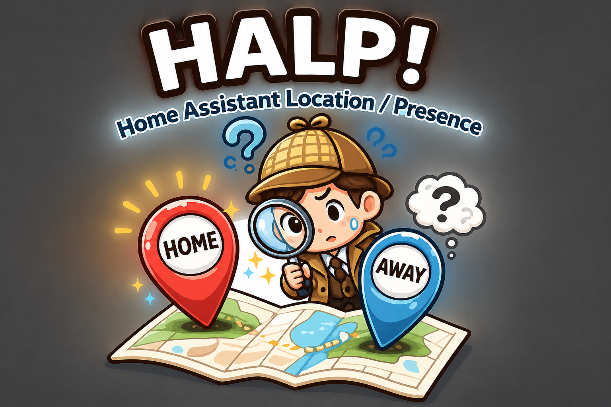
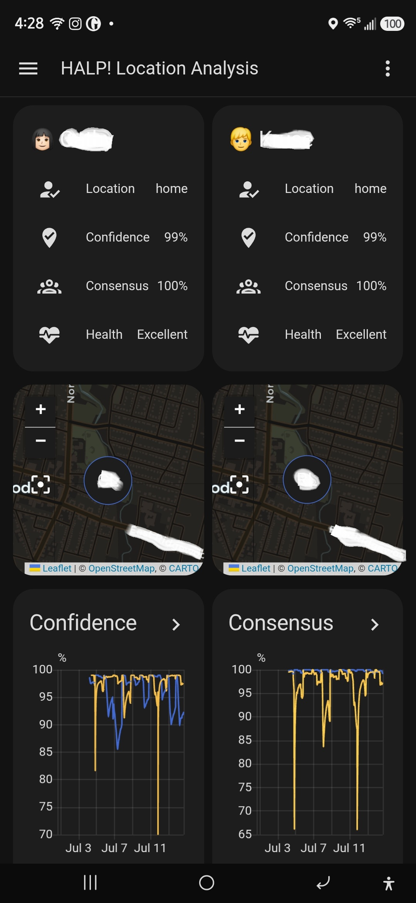
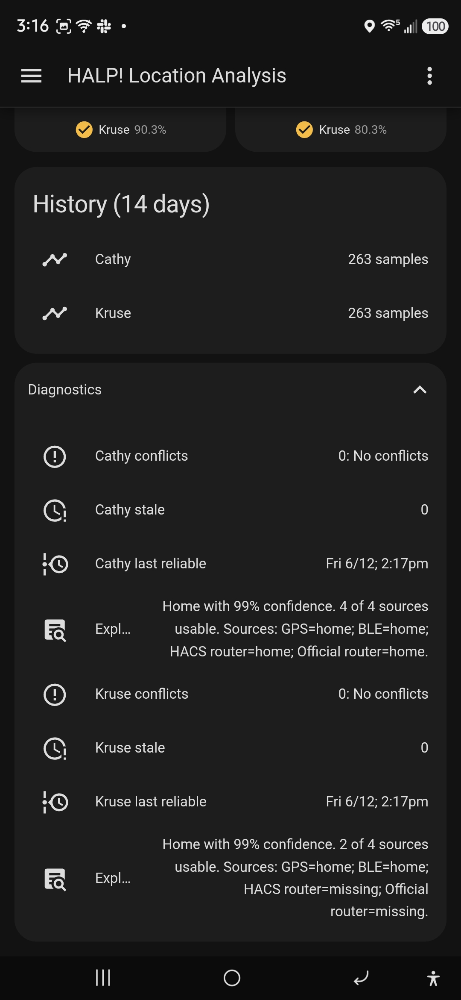

<p align="center">
  
</p>

<h1 align="center">HALP!</h1>

<p align="center">
Home Assistant Location & Presence analyzer
</p>

HALP! helps Home Assistant users understand, verify, and improve location-based automations.

HALP! does not replace Home Assistant Person entities, GPS trackers, BLE trackers, router trackers, or zone logic.

Instead, HALP! analyzes the location information Home Assistant already has and helps answer a simple question:

> How much should I trust Home Assistant's current location decision?

---

# Why HALP!?

Many Home Assistant users eventually encounter situations like:

* Why didn't my arrival lights turn on?
* Why didn't my garage door automation run?
* Why did Home Assistant think I was still Home?
* Why did Home Assistant think I had left?
* Why does GPS disagree with BLE?
* Why does router tracking never seem to work?
* Which location source should I trust?

Home Assistant provides many ways to determine location.

HALP! helps determine how reliable those methods actually are.

---

# Typical Use Cases

HALP! is especially useful when:

* Arrival automations do not trigger consistently
* Departure automations trigger unexpectedly
* GPS and BLE disagree
* Router tracking appears unreliable
* Multiple location sources produce conflicting results
* Users want objective measurements of tracker reliability

HALP! helps identify which sources deserve trust and which sources should be improved, replaced, or ignored.

---

# What HALP! Does

HALP! analyzes:

* Person entities
* GPS location sources
* BLE location sources
* Router/WiFi location sources
* Source freshness
* Source agreement
* Source conflicts
* Historical reliability

HALP! then produces:

* A vetted location assessment
* A confidence score
* A human-readable explanation
* Source-by-source analysis
* Historical reliability statistics
* Recommendations

---

# What HALP! Does Not Do

HALP! never:

* Modifies Person entities
* Modifies Device Trackers
* Replaces Home Assistant location logic
* Controls automations
* Tracks people independently
* Acts as a GPS tracker
* Acts as a BLE tracker
* Acts as a router tracker

HALP! is intentionally read-only.

---

# Design Philosophy

Most location integrations answer:

> Where is the person?

HALP! answers:

> How much confidence should I place in that answer?

This distinction is the foundation of the project.

---

# Location Analysis Engine

HALP! evaluates all configured location sources.

Supported source categories:

## GPS Sources

Examples:

* Home Assistant Companion App GPS
* iCloud3
* Other GPS-based trackers

A person may have zero, one, or many GPS sources.

---

## BLE Sources

Examples:

* Companion App BLE
* Bermuda
* ESPresense
* Bluetooth Proxy
* Other BLE-based trackers

A person may have zero, one, or many BLE sources.

---

## Router/WiFi Sources

Examples:

* UniFi
* Omada
* OpenWRT
* Other router-based trackers

A person may have zero, one, or many router sources.

---

# Source Freshness

HALP! evaluates freshness using:

```text
last_updated
```

Freshness answers:

> When did this source last report?

A fresh source generally deserves more trust than a stale source.

---

# State Duration

HALP! separately evaluates:

```text
last_changed
```

State duration answers:

> How long has this source been in the same state?

Example:

```text
GPS reports Home
Updated: 2 minutes ago
Unchanged: 9 hours
```

This means the source has continued reporting Home and recently refreshed.

---

# Historical Reliability

Historical analysis is expected to become one of HALP!'s most valuable features.

Example:

```text
BLE detected this phone during 46 of 50 GPS-confirmed Home visits.

BLE Reliability: 92%
```

Example:

```text
Router tracking detected this phone during 8 of 50 GPS-confirmed Home visits where WiFi appeared available.

Router Reliability: 16%
```

These measurements are installation-specific.

A source that works perfectly in one home may be nearly useless in another.

HALP! measures actual performance rather than relying on assumptions.

---

# Home Visit Definition

A Home Visit begins when the selected reference source transitions:

```text
Away -> Home
```

A Home Visit ends when the selected reference source transitions:

```text
Home -> Away
```

Everything in between is considered one Home Visit.

---

# Source Success During A Home Visit

A source receives credit for a Home Visit if it successfully detects the person at least once during that visit.

Temporary disconnects during the visit do not automatically make the visit a failure.

HALP! measures usefulness rather than connection stability.

---

# Example Analysis

Current Sources

| Source | State | Updated | Reliability |
| ------ | ----- | ------- | ----------- |
| GPS | Home | 2 min ago | 99% |
| BLE | Home | 1 min ago | 94% |
| Router | Away | 12 min ago | 18% |

Result

```text
Location: Home

Confidence: 96%
```

Explanation

```text
GPS and BLE currently support Home and were updated recently.

Router tracking disagrees, but historical analysis shows router tracking has only detected this device during 18% of GPS-confirmed Home visits where WiFi appeared available.

Router evidence is currently discounted.
```

---

# Supporting Evidence

HALP! may optionally use supporting sensors to help explain results.

Examples:

* Battery level
* Charging state
* WiFi SSID
* WiFi BSSID
* Connection type
* Location permission status

These values help explain confidence but are not primary location sources.

---

# Dashboard Examples

> **Note:** The confidence and consensus charts shown below are currently only partially populated. The most recent HALP! build included cleanup and removal of development and test history data. These screenshots will be updated after approximately two weeks of production data collection.

## Dashboard Overview

<p align="center">
  
</p>

The dashboard provides:

* Current vetted location
* Confidence score
* Consensus score
* Source health
* Historical confidence trends
* Historical consensus trends

---

## Diagnostics and Explainability

<p align="center">
  
</p>

The diagnostics section provides:

* Conflict detection
* Stale source detection
* Last reliable location timestamp
* Human-readable location explanations
* Source-by-source status reporting

Example explanation:

```text
Home with 99% confidence. 2 of 4 sources usable. Sources: GPS=home; BLE=home; HACS router=missing; Official router=missing.
```

---

# Example Dashboard Configuration

HALP! does not automatically create a dashboard because Home Assistant YAML dashboards cannot automatically loop through all configured people without additional custom frontend cards.

The examples below are intended as starting points.

## Finding Your HALP! Sensor Names

After creating a HALP! person entry:

```text
Settings -> Devices & Services -> Entities
```

Search for:

```text
halp_
```

You will see sensors similar to:

```text
sensor.halp_john_vetted_location
sensor.halp_john_location_confidence
sensor.halp_john_consensus_score
sensor.halp_john_source_health
```

Replace placeholders such as:

```text
<person_name_1>
```

with the actual HALP! entity slug.

Example:

```text
<person_name_1> -> john
```

would produce:

```text
sensor.halp_john_vetted_location
```

---

## Single Person Example Dashboard

```yaml
title: HALP!

views:
  - title: HALP! Location Analysis
    path: overview
    icon: mdi:map-search

    cards:
      - type: entities
        title: <person_name_1>
        entities:
          - entity: sensor.halp_<person_name_1>_vetted_location
            name: Location
          - entity: sensor.halp_<person_name_1>_location_confidence
            name: Confidence
          - entity: sensor.halp_<person_name_1>_consensus_score
            name: Consensus
          - entity: sensor.halp_<person_name_1>_source_health
            name: Health

      - type: history-graph
        title: Confidence
        hours_to_show: 336
        entities:
          - entity: sensor.halp_<person_name_1>_confidence_trend
            name: Person #1

      - type: history-graph
        title: Consensus
        hours_to_show: 336
        entities:
          - entity: sensor.halp_<person_name_1>_consensus_trend
            name: Person #1

      - type: entities
        title: History (14 days)
        entities:
          - entity: sensor.halp_<person_name_1>_history_summary
            name: Person #1

      - type: entities
        title: Diagnostics
        entities:
          - entity: sensor.halp_<person_name_1>_conflict_details
            name: Person #1 conflicts
            icon: mdi:alert-circle-outline
          - entity: sensor.halp_<person_name_1>_stale_sources
            name: Person #1 stale
          - entity: sensor.halp_<person_name_1>_last_reliable_change
            name: Person #1 last reliable
          - entity: sensor.halp_<person_name_1>_location_explanation
            name: Explanation
            icon: mdi:text-box-search
```

---

## Two Person Example Dashboard

This example uses two HALP! person entries.

Replace:

```text
<person_name_1>
<person_name_2>
```

with the actual HALP! entity slugs from your Home Assistant system.

```yaml
title: HALP!

views:
  - title: HALP! Location Analysis
    path: overview
    icon: mdi:map-search

    cards:
      - type: grid
        columns: 2
        square: false
        cards:
          - type: vertical-stack
            cards:
              - type: entities
                title: <person_name_1>
                entities:
                  - entity: sensor.halp_<person_name_1>_vetted_location
                    name: Location
                  - entity: sensor.halp_<person_name_1>_location_confidence
                    name: Confidence
                  - entity: sensor.halp_<person_name_1>_consensus_score
                    name: Consensus
                  - entity: sensor.halp_<person_name_1>_source_health
                    name: Health

          - type: vertical-stack
            cards:
              - type: entities
                title: <person_name_2>
                entities:
                  - entity: sensor.halp_<person_name_2>_vetted_location
                    name: Location
                  - entity: sensor.halp_<person_name_2>_location_confidence
                    name: Confidence
                  - entity: sensor.halp_<person_name_2>_consensus_score
                    name: Consensus
                  - entity: sensor.halp_<person_name_2>_source_health
                    name: Health

      - type: grid
        columns: 2
        square: false
        cards:
          - type: history-graph
            title: Confidence
            hours_to_show: 336
            entities:
              - entity: sensor.halp_<person_name_1>_confidence_trend
                name: Person #1
              - entity: sensor.halp_<person_name_2>_confidence_trend
                name: Person #2

          - type: history-graph
            title: Consensus
            hours_to_show: 336
            entities:
              - entity: sensor.halp_<person_name_1>_consensus_trend
                name: Person #1
              - entity: sensor.halp_<person_name_2>_consensus_trend
                name: Person #2

      - type: vertical-stack
        cards:
          - type: entities
            title: History (14 days)
            entities:
              - entity: sensor.halp_<person_name_1>_history_summary
                name: Person #1
              - entity: sensor.halp_<person_name_2>_history_summary
                name: Person #2

          - type: custom:expander-card
            title: Diagnostics
            padding: true
            clear: false
            cards:
              - type: entities
                entities:
                  - entity: sensor.halp_<person_name_1>_conflict_details
                    name: Person #1 conflicts
                    icon: mdi:alert-circle-outline
                  - entity: sensor.halp_<person_name_1>_stale_sources
                    name: Person #1 stale
                  - entity: sensor.halp_<person_name_1>_last_reliable_change
                    name: Person #1 last reliable
                  - entity: sensor.halp_<person_name_1>_location_explanation
                    name: Explanation
                    icon: mdi:text-box-search

                  - entity: sensor.halp_<person_name_2>_conflict_details
                    name: Person #2 conflicts
                    icon: mdi:alert-circle-outline
                  - entity: sensor.halp_<person_name_2>_stale_sources
                    name: Person #2 stale
                  - entity: sensor.halp_<person_name_2>_last_reliable_change
                    name: Person #2 last reliable
                  - entity: sensor.halp_<person_name_2>_location_explanation
                    name: Explanation
                    icon: mdi:text-box-search
```

---

## Example configuration.yaml Entry

If using a YAML dashboard, add a dashboard entry similar to this:

```yaml
lovelace:
  dashboards:
    halp:
      mode: yaml
      title: HALP!
      icon: mdi:map-search
      show_in_sidebar: true
      filename: /config/halp_dashboard.yaml
```

Then place your dashboard YAML at:

```text
/config/halp_dashboard.yaml
```

Restart Home Assistant or reload Lovelace dashboards after adding the dashboard entry.

---

# Future Direction

Planned future enhancements include:

* Historical source reliability scoring
* Automatic source weighting
* Zone-specific reliability analysis
* Reliability recommendation engine
* Long-term reliability trend analysis
* Dynamic dashboard generation

The focus will remain on location reliability, confidence, diagnostics, and explainability.

---

# License

See the repository license for licensing terms and conditions.

---

Created with the assistance of AI during development and documentation. HALP! DOES NOT USE ANY AI AT ANY TIME DURING INSTALLATION OR OPERATION.
